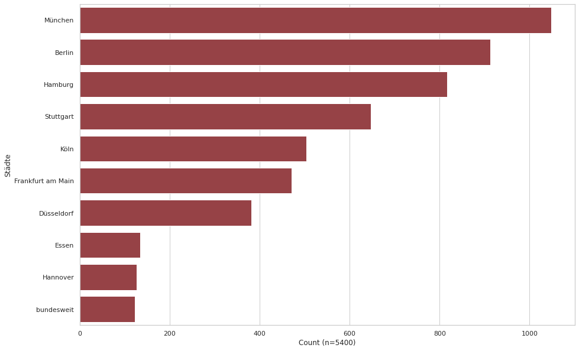
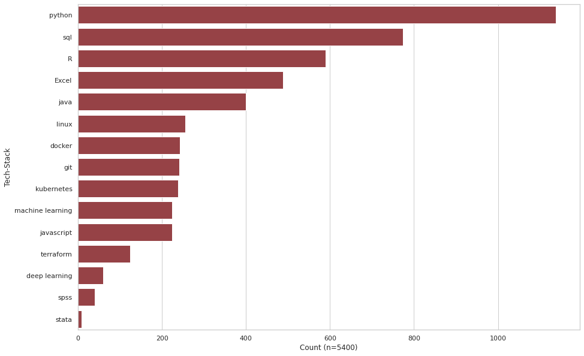
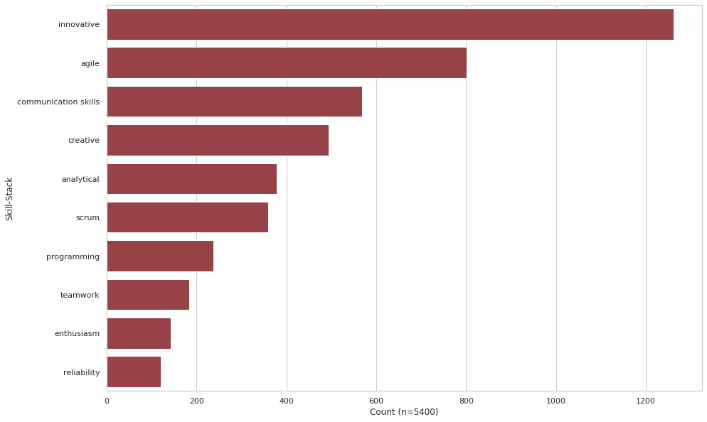
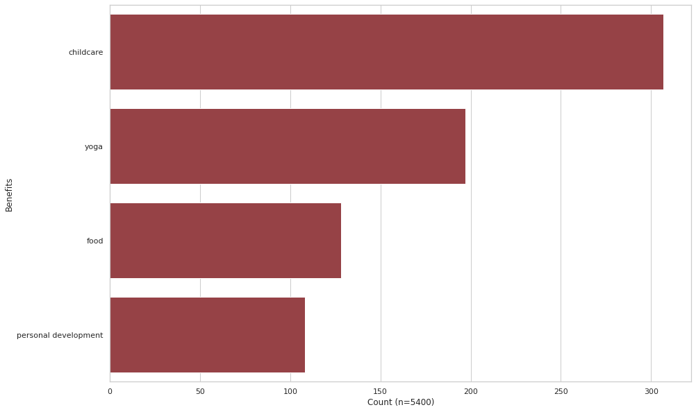

# Data Science Job Description Analysis 

**How should a Data Scientist prepare best for the job market?**

I shared some practical insights with [Prof. Dr. Dennis Klinkhammer](https://de.linkedin.com/in/dr-dennis-klinkhammer) and his Big Data and Business Analytics students at [FOM - University of Applied Sciences](https://www.fom.de/) regarding that specific question – and that’s my approach:

Being a Data Scientist myself [myself](https://de.linkedin.com/in/rubenwienigk), I especially love the process of collecting and analyzing unstructured data and so I programmed a bot and collected over 5.400 job postings regarding the keyword "Data Science" on []() Stepstone. Using Natural Language Processing, I was able to extract some of the required skills (thanks to [Spacy](https://spacy.io/) and [SkillNer](https://github.com/AnasAito/SkillNER)). 

**The results:** I found a bit of everthing. In Germany, Data Scientists seem to be broad generalists. It is particularly noticeable that Python is relevant in every 5th job ad, (followed by SQL in every 7th and subsequently R in every 9th). 

**What is the reason for this?** A Machine Learning model is only valuable if the customer can use it! With Python, being a high-level programming language, end-to-end processes can be implemented incredibly well. However, Data Science is not just about Machine Learning. The infrastructures and data pipelines that come before and after the development of models are also of utmost importance. As a result, Data Engineering skills like Docker, Kubernetes, Linux and GIT seem to be even more relevant than the common Machine Learning stack. That’s not surprising at all: Due to the rapidly increasing performance of cloud providers and the further development of [Auto-ML systems](https://openml.github.io/automlbenchmark/automl_overview.html) , the work and relevance of classic Data Scientists is changing. 

**But not only the tech stack is important!** A Data Scientist should be innovative, agile, creative, analytical and strong in communication. Phew! And a single person should be able to have deep knowledge of all these complex technologies and methodologies?

**My answer to the initial question can only be:** Stay broad with your stack at the beginning! Because most companies lack a bit of everything. In dialogue, you can then specialize together and create the best possible product.

## Prerequisites

1. Python
2. [Docker Desktop](https://www.docker.com/products/docker-desktop/)
3. [VS Code](https://code.visualstudio.com/) (optional)
4. Kubernetes Cluster / [Minikube](https://minikube.sigs.k8s.io/docs/start/) (optional)

## Installation

### Use Visual Studio Code Remote - Containers 

Use [Visual Studio Code Remote-Containers ](https://code.visualstudio.com/docs/remote/containers) to start ready to use development enviroment. 

1. Open VS Code and navigate to folder.

2. Open a folder with Remote-Containers

3. Run [Selenium](https://github.com/SeleniumHQ/docker-selenium)  

```bash
./run_selenium.sh -m standalone
```

| command   |      info      |  
|------------|:-------------:|
| -m standalone | (default) Standalone Selenium Webdriver. Only one Standalone container can run on port 4444 at the same time.  | 
| -m compose | Use Docker Compose to start a Selenium Grid. |  
| -m kubernetes | Use Kubectl apply to deploy a Selenium Grid on your Kubernetes Cluster  |   

### Use Python enviroment

1. Use the package manager [pip](https://pip.pypa.io/en/stable/) to install all requirements.

```bash
pip3 --disable-pip-version-check --no-cache-dir install -r requirements.txt
```

2. Install Spacy language models

```bash
python -m spacy download en_core_web_lg 
python -m spacy download de_core_news_sm
```

3. Run Selenium 

```bash
chmod +x run_selenium.sh 
./run_selenium.sh -m standalone
```

## Use Scraper

1. Change Scraper config parameter if needed
```python
__config_dict =  {
    "projekt_name":"full_stepstone_DS_crawl",
    "hub_session" : False, #Attach to current Selenium Grid Session by ID 
    "max_pages": 380, 
    "job": "'Data Science'",
    "hub_url" : "http://127.0.0.1:4444/wd/hub",
    "url" : "https://www.stepstone.de/",
    "search_x_path": "/html/body/div[2]/div[1]/div[3]/div/div/div/div/div[1]/div[1]/div[1]/div/div[2]/input", 
    "cookie_disclamer_xpath" : "//div[@id = 'ccmgt_explicit_accept']",
    "headline_xpath" : "//h2[@class='sc-pJurq hXakmZ']",
    "city_xpath" : "//li[@class='sc-qQMSE gzFHUw sc-pBzUF eUumVw']",
    "links_xpath" : "//a[@class='sc-pAZqv cyGFEN']",
    "text_xpath" : "//div[@itemprop='description']//p|//div[@itemprop='description']//b|//div[@itemprop='description']//li",
    "next_page_xpath" : '//a[@data-at="pagination-next"]',
    "prod": False # If prod = True, content will saved to inline json
}
```

2. Start Scraping 

```bash
python scraper.py
```

## Results

1. Top Cities
   


2. Top Tech-Stack



3. Top Skills



4. Top Benefits




## Contributing
Sharing is caring
